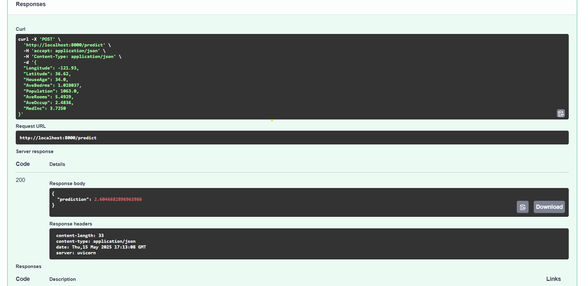
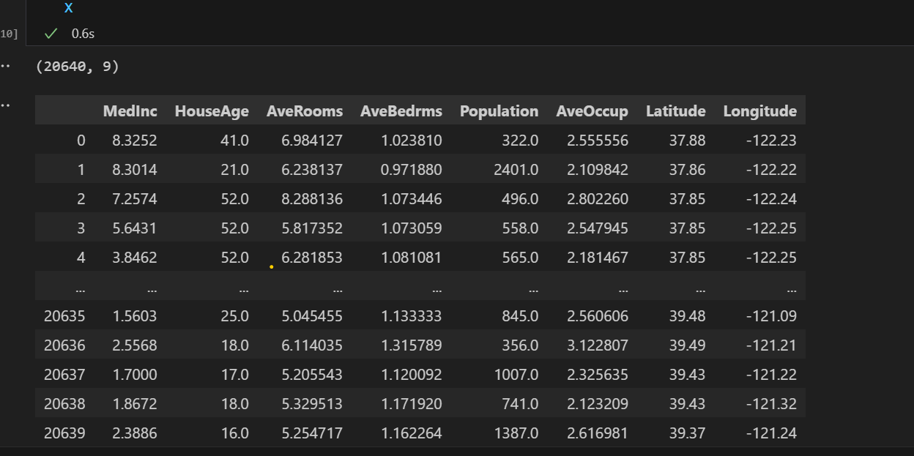
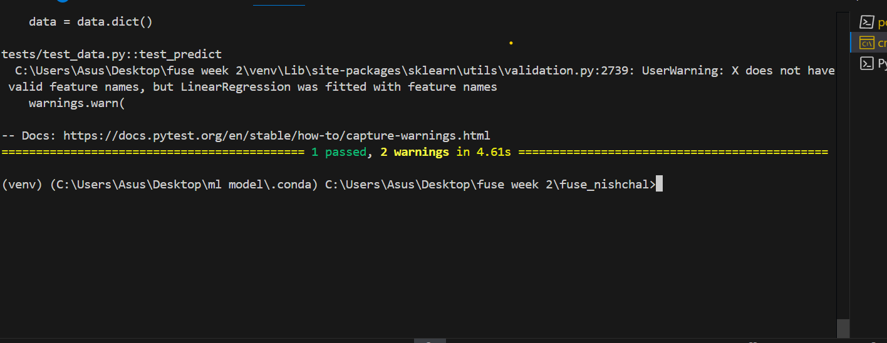

# Fuse_nishchal

<a target="_blank" href="https://cookiecutter-data-science.drivendata.org/">
    
</a>

# FastAPI Housing Price Prediction 🚀

This is a FastAPI-based application that predicts house prices using a trained machine learning model (California Housing Dataset).

## 📦 Features
- REST API using FastAPI
- ML model served with Joblib
- Dockerized for easy deployment
- Includes test case using pytest
- GitHub Actions CI ready

## 🐳 Run with Docker

```bash
docker build -t house-price-app .
docker run -p 8000:8000 house-price-app


```markdown


## Project Organization

```
├── LICENSE            <- Open-source license if one is chosen
├── Makefile           <- Makefile with convenience commands like `make data` or `make train`
├── README.md          <- The top-level README for developers using this project.
├── data
│   ├── external       <- Data from third party sources.
│   ├── interim        <- Intermediate data that has been transformed.
│   ├── processed      <- The final, canonical data sets for modeling.
│   └── raw            <- The original, immutable data dump.
│
├── docs               <- A default mkdocs project; see www.mkdocs.org for details
│
├── models             <- Trained and serialized models, model predictions, or model summaries
│
├── notebooks          <- Jupyter notebooks. Naming convention is a number (for ordering),
│                         the creator's initials, and a short `-` delimited description, e.g.
│                         `1.0-jqp-initial-data-exploration`.
│
├── pyproject.toml     <- Project configuration file with package metadata for 
│                         fuse_nishchal and configuration for tools like black
│
├── references         <- Data dictionaries, manuals, and all other explanatory materials.
│
├── reports            <- Generated analysis as HTML, PDF, LaTeX, etc.
│   └── figures        <- Generated graphics and figures to be used in reporting
│
├── requirements.txt   <- The requirements file for reproducing the analysis environment, e.g.
│                         generated with `pip freeze > requirements.txt`
│
├── setup.cfg          <- Configuration file for flake8
│
└── fuse_nishchal   <- Source code for use in this project.
    │
    ├── __init__.py             <- Makes fuse_nishchal a Python module
    ├── app/                  # Main FastAPI app
    │       ├── main.py
    │       └── ...
    │
    ├── config.py               <- Store useful variables and configuration
    │
    ├── dataset.py              <- Scripts to download or generate data
    │
    ├── features.py             <- Code to create features for modeling
    │
    ├── modeling                
    │   ├── __init__.py 
    │   ├── predict.py          <- Code to run model inference with trained models          
    │   └── train.py            <- Code to train models
    │
    └── plots.py                <- Code to create visualizations
```

--------
## 🚀 Screenshots


### 🐳 Docker Container Running
![Docker Running]_(screenshots/inputforpredictor.png)

###Response




###input features for ml model


### unit testing/pytest result




